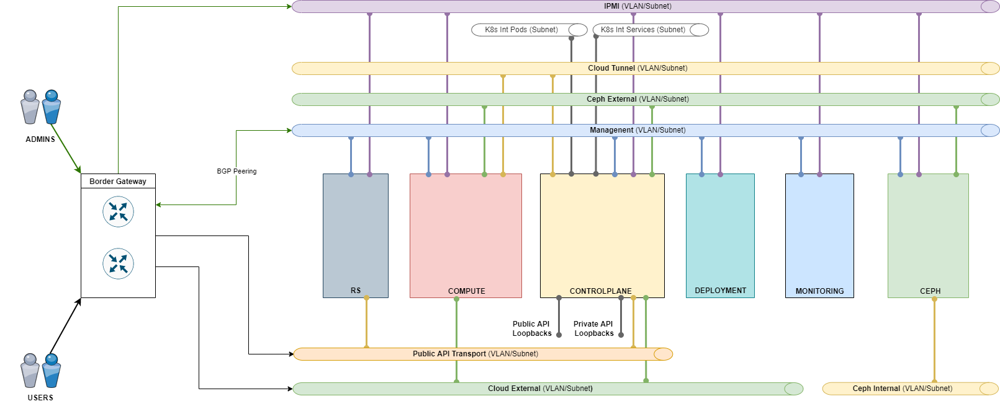
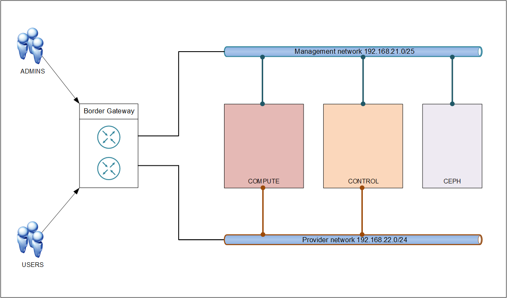

# Создание облака OpenStack с помощью kolla-ansible.
Цель данной статьи структурировать информацию полученную из разных источников и предложить минимально возможную рабочую инструкцию для новичков по быстрому запуску облачной платформы OpenStack в базовой конфигурации для тестирования.
### Немного определимся со схемой кластера и количеством серверов, необходимых для запуска OpenStack в минимальной конфигурации.
#### Для информации приведу тут пример типового решения одного известного облачного провайдера для организации частного Мини-облака из 10 гипервизоров на базе OpenStack.
| № | Роль | Кол-во | CPU | RAM (ГБ) | Storage | Сетевые интерфейсы |
| ----- | ----- | ----- | ----- | ----- | ----- | ----- |
|1|Deploy|1|1x Intel Xeon E-2314|8|2x 1 Тбайт HDD|1x10Gb|
|2|Controlplane|3|2x Intel Xeon Silver 4210R|256|2x 480 Гбайт SSD|4x10 Gb 2хLACP|
|3|Compute|10|2x Intel Xeon Gold 6238R|1024|2x 480 Гбайт SSD|4x10Gb 2хLACP
|4|Ceph|3|2x Intel Xeon Silver 4210R|128|2x 480 Гбайт SSD, 6x 7.68 Тбайт SSD|4x10Gb 2хLACP|
|5|Route Server (RS)|2|1x Intel Xeon E-2314|8|2x 480 Гбайт SSD|2x10Gb LACP|
|6|Monitoring/Logging|1|2x Intel Xeon Silver 4210R|128|2x 1.92 Тбайт SSD|2x10Gb LACP|

#### Как видим серверы разделены по ролям/группам, по сути они схожи c ролями в ванильном OpenStack, поэтому немного расшифруем суть этих ролей.  
#### Deploy
Эта группа представлена единственным сервером и используется начиная с самых начальных этапов развертывания платформы. Основные задачи Deploy-сервера:
- С него выполняется запуск механизмов развертывания платформы.
- Он используется для изменения настроек, обновления и восстановления платформы.
- С его помощью производится подготовка новых гипервизоров к вводу в работу.
- Он используется для размещения сервиса репозитория пакетов и образов компонентов облачной платформы. Помимо них, в нем размещаются и docker-образы части PaaS-сервисов.  

Высоких требований к конфигурации и отказоустойчивости сервера не предъявляется. Требуется только один сервер, допустимо дублирование роли. В любом случае необходимо выполнять регулярное резервное копирование узла и периодически проверять корректность его восстановления.  
Для размещения этой роли допустимо использовать виртуальные машины.  
Крайне важно, чтобы Deploy-сервер не был отключен после развертывания платформы, а был постоянно доступен для функционирования PaaS-сервисов, которые в своей работе используют репозитории Nexus.

#### Controlplane
На серверах этой группы осуществляется работа служб слоя управления Платформой и программно-определяемой сети. Для этих серверов рекомендуется использовать многоядерные процессоры и большие объемы памяти.
Минимальное количество серверов Controlplane в инсталляции — 3; добавление происходит кратно 3.  
В больших инсталляциях возможно дальнейшие разделение ролей и выделение следующих узлов:
- Network узлы, обеспечивающие работу SDN.
- Узлы K8s для служебного кластера Kubernetes, в котором работает часть сервисов Controlplane.
- Отдельные узлы для служебной СУБД.  

#### Compute
Серверы этой группы непосредственно несут полезную нагрузку — на них выполняются ВМ и PaaS-сервисы. Рекомендованные конфигурации отличаются высокой вариативностью в зависимости от требований. Возможно применение различных конфигураций в рамках роли с объединением одинаковых серверов в агрегаты гипервизоров.
Общая рекомендация:
- Использовать процессоры с максимальным количеством ядер при заданной частоте.
- Объем памяти зависит от требований к сайзингу и допустимых коэффициентов переподписки.  

Минимальное количество серверов Compute в инсталляции — 1; добавление можно производить по одному серверу.  

#### Ceph
Ceph является основным вариантом реализации системы хранения данных для облачной платформы. Формируются кластеры от 3 до 9 узлов. При необходимости использования большего количества серверов хранения, из них формируется несколько кластеров.
Особенности:
- Ceph генерирует большой объем трафика, поэтому для внутреннего взаимодействия компонентов используется отдельная сеть (VLAN), развернутая на отдельных сетевых интерфейсах — как в случае с 10 Гбит/с интерфейсами, так и с более производительными вариантами.  
- Ceph не требует высокопроизводительных процессоров, но требует достаточно большой объем оперативной памяти.
- Не используется RAID. Диски отдаются в Ceph индивидуально, один диск = один Ceph OSD. В отдельных случаях, например, для NVMe дисков — два ceph OSD на диск.  
- Надежность хранения данных обеспечивается за счет троекратной репликации данных по серверам кластера Ceph.  

Минимальное количество узлов Ceph — 3 сервера. Добавлять допустимо количество серверов, кратное трем. Допустимо использовать различные диски в разных кластерах Ceph для обеспечения различных уровней производительности.

#### Route Server (RS)
Серверы этой группы выполняют функции BGP Route Reflector для обеспечения работы и отказоустойчивости веб-портала, внешних и внутренних эндпойнтов и сервисов в служебном кластере Kubernetes.  
RS и Controlplane узлы должны находиться в одной автономной системе (AS) и иметь iBGP соседство. Между RS узлами и пограничными BGP маршрутизаторами сети провайдера устанавливается eBGP соседство таким образом, чтобы Next-Hop префиксов передаваемых от RS к пограничным маршрутизаторам не изменялся (опция Next-Hop unchanged).  
Если есть техническая возможность установить iBGP соседство между ControlPlane узлами и BGP RR провайдера, то серверы RS можно исключить из схемы анонсов префиксов веб-портала, внешних и внутренних эндпойнтов и сервисов в служебном кластере Kubernetes.  
Для production инсталляций всегда требуется два сервера. Для тестовых контуров допустимо использовать один сервер или виртуальную машину.  
Данная роль опциональна — возможно использование функционала сетевого оборудования.

#### Monitoring/Logging
На серверах группы Monitoring/Logging размещаются сервисы мониторинга и логирования:
- Мониторинг реализован на базе Zabbix с использованием MySQL для хранения данных.
- Логирование реализовано на связке OpenSearch/OpenSearch Dashboard c Logstash, Kafka и Filebeat.  

Особенностью серверов этой роли является высокая зависимость нагрузки от объема и состава платформы.
Для размещения этой роли допустимо использовать виртуальные машины.  
По умолчанию рекомендуется закладывать один сервер. При большом размере инсталляции или при интеграции хранилища S3 может потребоваться увеличение числа серверов.  


Рисунок 1 — Сетевая схема L2 без выделенных Network узлов  

Облачная платформа требует для работы набор сетей, разделенных по технологии VLAN. Они отражены на схеме, также их список приведен в таблице ниже.

| Название | Описание сети | Маска | Доступ | Комментарий |
| ----- | ----- | ----- | ----- | ----- |
|Management|Сеть для внутреннего взаимодействия компонентов платформы|/24|Админи-страторам|Основная сеть управления. Также выполняет роль транспортной для Private API Loopback (в этой сети находятся Next hop для данных K8s и Private API)
|Private API Loopback|Сеть для доступа компонентов к API|/29|Нет|Пул loopback-адресов для HAProxy — внутренние эндпойнты, фактически три /32 префикса
|Public API Transport (Portal)|Транспортная сеть для Public API Loopback|/29|Пользова-телям|Выполняет роль транспортной для Public API Loopback (в этой сети находятся Next hop для Public API)
|Public API Loopback|Сеть для доступа пользователей к панели управления и API|/29|Пользова-телям|Пул loopback адресов для HAProxy — внешние эндпойнты и портал, фактически три /32 префикса
|K8s Internal|Внутреняя сеть Kubernetes|/24|Нет|Резерв адресов для внутренних нужд K8s в пределах Controlplane: подсети, которые ни при каких обстоятельствах не будут конфликтовать с другими подсетями в корпоративной сети
|Cloud Tunnel|Сеть для внутренних интерфейсов ВМ|/24|Нет|Транспортная сеть для VxLAN туннелей.
|Cloud External|Сеть для внешних интерфейсов ВМ (корпоративная сеть)|/16|Пользова-телям|Допустимо изменение размерности в зависимости от требований к количеству Floating IPs
|Сeph External|Сеть для доступа к данным СХД/Ceph|/24|Нет|
|Сeph Internal|Кластерная сеть Ceph|/24|Нет|
|IPMI|Сеть с IPMI-интерфейсами|/24|Админи-страторам|Access Mode

Такое разделение сетей обосновано необходимостью разделить потоки данных для обеспечения производительности и информационной безопасности платформы. Сети должны подаваться на серверы исходя из требований по пропускной способности. Например, для Compute-узлов на отдельные интерфейсы выносится сеть для связи с СХД (Ceph External), а на узлах Ceph отдельно выносится сеть для внутреннего трафика кластера (Ceph Internal).  
Состав сетей может меняться. Например, при наличии соответствующих требований может быть несколько сетей Cloud External, в частности, для взаимодействия с различными производственными средами (Dev/Test/Prod). При этом не стоит путать раздельные сети Cloud External и наращивание емкости основной сети Cloud External с добавлением множества подсетей. Сеть Cloud Tunnel напротив является опциональной — есть смысл ее выделить, если предусмотрены отдельные физические интерфейсы для трафика виртуальных сетей, иначе разумно использовать сеть Management в качестве транспортной для этого трафика.  
В таблице выше приведены рекомендуемые размерности сетей. Обратите внимание на основные принципы их использования:
- Сети Public API Loopback и Private API Loopback используются для выделения префиксов с маской /32 для назначения на Loopback, которые привязаны на соответствующих HAProxy. На каждую HAProxy привязывается 3 Loopback для Public API и 3 Loopback для Private API.
- Сеть Public API Transport используется для транспорта пользовательского трафика из корпоративной сети к Loopback Public API.
- Адреса из сети Public Transport API назначаются на узлах Control и узлах RS, либо если узлы RS отсутствуют в решении на роутерах корпоративной сети.
- Адреса, назначенные на Control-узлах, используются как next-hop адреса для префиксов Public API при анонсе маршрутов по BGP RS узлам или вышестоящим маршрутизаторам.  

Для всех сетей требуется использование IP-адресов, уникальных в пределах корпоративной сети. В том числе и для сетей, выделенных под нужды служебного кластера K8s.

---
### Учитывая вышеизложенное возникает вопрос, а что же сможем сделать мы, с чего начать?
Официальная документация по разворачиванию платформы OpenStack предлагает нам множество способов установки, например devstack, microstack, TrippleO или можно в ручном режиме по очереди устанавливать и настраивать базовые сервисы OpenStack на железных серверах или виртуальных машинах. Кстати новичкам рекомендуется воспользоваться именно [ручным способом](https://docs.openstack.org/install-guide/openstack-services.html) установки сервисов OpenStack, так как это дает понимание работы базовых компонентов и их взаимодействие между собой.  
Мы же считаем себя продвинутыми пользователями поэтому воспользуемся инструментом [Kolla-ansible версии Yoga](https://docs.openstack.org/kolla-ansible/yoga/user/quickstart.html). Это способ предполагает развертывания компонентов платформы OpenStack из образов контейнеров Docker с единого узла управления (Deploy-node) с помощью сценариев/плейбуков Ansible.  
Будем запускать тестовый/демонстрационный стенд на виртуальных машинах в кластере VMware.  
Для этого мы используем минимально возможную конфигурацию OpenStack:  

| № | Роль | Кол-во | CPU | RAM (ГБ) | Storage | Сетевые интерфейсы |
| ----- | ----- | ----- | ----- | ----- | ----- | ----- |
|1|Deploy|1|2 vCPU|8|50 Гбайт vHDD|1Gb|
|2|Control|3|4 vCPU|8|50 Гбайт vHDD|2x1Gb|
|3|Compute|2|6 vCPU|12|50 Гбайт vHDD|2x1Gb|
|4|Ceph|3|4 vCPU|8|50 Гбайт vHDD, 300 Гбайт vHDD|1Gb|

Сервера с ролью Route Server (RS) и Monitoring/Logging мы не используем, а их функционал частично распределим по серверам с ролью Controlplane/Сontrol. А в качестве сервера с ролью Deploy будет выступать наш ноутбук на Windows 10 с включенной подсистемой WSL2 и установленным распределением Ubuntu20.04, так как мы не планируем создавать локальные репозитории Nexus и т.п.  
Также мы будем использовать минимально возможный набор сетей:
- Management network, будет использоваться как сеть для управления кластерами OpenStack и Ceph, сеть для доступа к данным Ceph, сеть для VxLAN туннелей, сеть для внутреннего взаимодействия компонентов платформы и доступа к API
- Provider network (Cloud External), будет использоваться как сеть для внешних интерфейсов ВМ (инстансов)

Теперь наша топология будет выглядить так:


---
### Начальная настройка серверов перед установкой Kolla-ansible и служб OpenStack.
Kolla Ansible релиз Yoga поддерживает следующие хост-операционные системы (ОС):
- CentOS Stream 8
- Debian Bullseye (11)
- openEuler 20.03 LTS SP2
- RHEL 8 (deprecated)
- Rocky Linux 8
- Ubuntu Focal (20.04)

А также следующие образы контейнеров (параметр kolla_base_distro):
- centos
- debian
- rhel (deprecated)
- ubuntu

И так в качестве хост-операционной системы выберем CentOS Stream 8, также в базовой конфигурации служб OpenStack, на серверах с ролью Control и Сompute нам понадобиться 2 сетевых интерфейса, для организации сети управления (Management network) и внешних интерфейсов ВМ (Provider network).  
Настройку первого интерфейса `ens32` мы выполняем в процессе инсталляции операционной системы, задаем ip-адрес, маску, шлюз (из сети 192.168.21.0/25) и DNS.  
А вот на втором интерфейсе `ens34` нет необходимости настраивать ip-адрес, маску и т.д., он должен быть просто включен, например вот так:
```bash
sed -i -e 's/^ONBOOT=.*/ONBOOT=yes/; s/^BOOTPROTO=.*/BOOTPROTO=none/; s/^DNS1=.*/d' /etc/sysconfig/network-scripts/ifcfg-ens34
```
Проверим загружен ли модуль `br_netfilter`. Этот модуль необходим для передачи трафика расширяемой виртуальной локальной сети (VxLAN) между bridge интерфейсами в кластере OpenStack.  
Для проверки выполним команду:
```bash
lsmod | grep br_netfilter
```
Если вывод пустой то значит что модуль не включен. Загрузим модуль вручную и добавим его как постоянный:
```bash
modprobe br_netfilter && echo "br_netfilter" > /etc/modules-load.d/br_netfilter.conf && sysctl -p
```
Также убедимся, что ядро операционной системы Linux поддерживает обработку iptables для пакетов проходящих через bridge интерфейсы, значения `net.bridge.bridge-nf-call-iptables`, `net.bridge.bridge-nf-call-iptables` и `net.bridge.bridge-nf-call-arptables` должны быть установлены на 1:
```bash
sysctl -p | grep net.bridge.bridge-nf-call
```
Если это не так то выполним:
```bash
sed -i '$a \\nnet.bridge.bridge-nf-call-iptables = 1\nnet.bridge.bridge-nf-call-ip6tables = 1\nnet.bridge.bridge-nf-call-arptables = 1' /etc/sysctl.conf
```
Определим, поддерживает ли наш вычислительный узел (Compute) аппаратное ускорение для виртуальных машин:
```bash
egrep -c '(vmx|svm)' /proc/cpuinfo
```
Если эта команда возвращает значение, равное единице или больше, ваш вычислительный узел поддерживает аппаратное ускорение, которое обычно не требует дополнительной настройки.  
Если эта команда возвращает нулевое значение, ваш вычислительный узел не поддерживает аппаратное ускорение, и вы должны настроить libvirt для использования QEMU вместо KVM.  

### Установка на Deploy-ноду (ноутбук с WSL2) Kolla-Ansible.
Обновим систему, установим виртуальное окружение и зависимости:
```bash
sudo apt update
sudo apt upgrade
sudo apt install python3-dev libffi-dev gcc libssl-dev
sudo apt install python3-venv
mkdir ~/ansible/openstack
cd ~/ansible/openstack
python3.8 -m venv kolla-ansible
source ~/ansible/openstack/kolla-ansible/bin/activate
pip install -U pip
```
Kolla-Ansible требует как минимум Ansible версии 4 и поддерживает до 5 версии включительно.  
Установим kolla-ansible и зависимости с помощью pip и настроим директории для конфигурационных файлов:
```bash
pip install -U 'ansible>=4,<6'
pip install git+https://opendev.org/openstack/kolla-ansible@stable/yoga
sudo mkdir -p /etc/kolla
sudo chown $USER:$USER /etc/kolla
cp -r ~/ansible/openstack/kolla-ansible/share/kolla-ansible/etc_examples/kolla/* /etc/kolla
cp ~/ansible/openstack/kolla-ansible/share/kolla-ansible/ansible/inventory/* .
```
Установим зависимости Ansible Galaxy (необходимы начиная с OpenStack версии Yoga):
```bash
kolla-ansible install-deps
```
Изменим глобальный конфигурационный файл Ansible:
```bash
sudo vi /etc/ansible/ansible.cfg
[defaults]
host_key_checking = False
pipelining = True
gathering = smart
forks = 20
timeout = 30
```
> **Обратите внимание**, что при работе с kolla-ansible нужно всегда будет загружать виртуальное окружение и переходить в рабочую директорию, например вот так:
> ```bash
> source ~/ansible/openstack/kolla-ansible/bin/activate
> cd ~/ansible/openstack/ansible
> ```

---
### Настройка на Deploy-ноде конфигурационных файлов Kolla для разворачивания платформы OpenStack.
Следующим шагом является подготовка нашего файла инвентаризации. **Инвентаризация** — это файл Ansible, в котором мы указываем хосты и группы, к которым они принадлежат. Мы можем использовать это для определения ролей узла и учетных данных доступа. Kolla Ansible поставляется с примерами инвентарных файлов «все на одном узле» и в конфигурации с несколькими узлами.  
Отредактируем только те разделы в файле `multinode`, которые необходимы в вашей среде:
```bash
vi multinode
[all:vars]
ansible_user=root
# Здесь должен быть пароль root для серверов
ansible_passwd=`ХХХХХХХХХ`

# These initial groups are the only groups required to be modified. The
# additional groups are for more control of the environment.
[control]
#These hostname must be resolvable from your deployment host
control[01:03]

# The above can also be specified as follows:
#control[01:03]     ansible_user=kolla

# The network nodes are where your l3-agent and loadbalancers will run
# This can be the same as a host in the control group
[network:children]
control

[compute]
compute[01:02]

[monitoring]
control01

# When compute nodes and control nodes use different interfaces,
# you need to comment out "api_interface" and other interfaces from the globals.yml
# and specify like below:
#compute01 neutron_external_interface=eth0 api_interface=em1 storage_interface=em1 tunnel_interface=em1

[storage]
cephnode[01:03]

[deployment]
localhost       ansible_connection=local become=true
```
Настраиваем файл `/etc/hosts` на Deploy-node:
```bash
vi /etc/hosts
# Deploy-node for Kolla-ansible
192.168.21.106    control01
192.168.21.107    control02
192.168.21.108    control03
192.168.21.109    compute01
192.168.21.110    compute02
192.168.21.117    cephnode01
192.168.21.118    cephnode02
192.168.21.119    cephnode03
```
Скопируем ssh ключ на настраиваемые сервера, для доступа без пароля:
```bash
ssh-copy-id root@control01
ssh-copy-id root@control02
ssh-copy-id root@control03
ssh-copy-id root@compute01
ssh-copy-id root@compute02
ssh-copy-id root@cephnode01
ssh-copy-id root@cephnode02
ssh-copy-id root@cephnode03
```

---
### Установка и настройка кластера Ceph.
#### Подготовим сервера к разворачиванию кластера Ceph.
> **Обратите внимание, что перед разворачиванием OpenStack нужно обязательно настроить кластер Ceph и сгенерировать связки ключей для подключения служб.** Эту задачу сценарий Kolla Ansible не решает.

[Официальная документация по Ceph](https://docs.ceph.com/en/latest/install/) предлагает нам несколько способов установки, например через `ceph-ansible` или `Cephadm`.  
Воспользуемся `Cephadm` так как это рекомендованный способ установки.
Настроим файл `/etc/hosts` на серверах кластера Ceph: 
```bash
vi /etc/hosts  
192.168.21.117  cephnode01
192.168.21.118  cephnode02
192.168.21.119  cephnode03
```
Так как кластер Ceph очень чувствителен к задержкам в синхронизации времени, то стандартная синхронизация времени когда каждый сервер берет время с серверов в Интернете нам не подойдет. Будем синхронизировать время с хоста `cephnode01` на остальные сервера кластера Ceph.  
На сервере `cephnode01` отредактируем файл `/etc/chrony.conf`:  
```bash
vi /etc/chrony.conf  
allow 192.168.0.0/16
```
Перезапустим службу синхронизация времени:
```bash
systemctl restart chronyd
```
Проверим в файерволе для каких служб разрешено подключение к нашему `cephnode01`:
```bash
firewall-cmd --list-all
```
Теперь откроем порт для подключения к синхронизации времени:
```bash
firewall-cmd --add-service=ntp
firewall-cmd --add-service=ntp --permanent
```
На остальных серверах кластера Ceph настроим синхронизацию с сервера `cephnode01`:  
```bash
vi /etc/chrony.conf
server cephnode01 iburst
```
Перезапустим службу:
```bash
systemctl restart chronyd
```
Чтобы проверить информацию о текущих параметрах синхронизации времени, используем команды:
```bash
chronyc sources -v
chronyc tracking
```
Теперь устанавливаем на всех серверах кластера Ceph `Python3` и `Docker`, поскольку службы Ceph будут запускаться в контейнерах:
```bash
dnf install -y yum-utils
yum-config-manager \
    --add-repo \
    https://download.docker.com/linux/centos/docker-ce.repo
dnf install -y python39 docker-ce docker-ce-cli containerd.io docker-buildx-plugin docker-compose-plugin
```
#### Установка кластера Ceph.
> **Все дальнейшие операции выполняются на сервере `cephnode01`.**  

В первую очередь установим утилиту `cephadm`, с помощью которой будет производиться первичное создание и конфигурация кластера:
```bash
dnf install --assumeyes centos-release-ceph-quincy  
dnf install --assumeyes cephadm  
```
Запустим процедуру создания кластера в качестве параметра mon-ip указываю адрес `cephnode01`: 
```bash
cephadm bootstrap --mon-ip 192.168.21.117
```
Эта команда выполнит слудующее:
- Создаст службу мониторинга и управления для нового кластера на локальном хосте
- Создаст новый SSH-ключ для кластера Ceph и добавьте его в файл `/root/.ssh/authorized_keys` пользователя root
- Запишет копию открытого ключа в `/etc/ceph/ceph.pub`
- Запишет минимальный файл конфигурации в `/etc/ceph/ceph.conf`. Этот файл необходим для связи с новым кластером
- Запишет копию административного (привилегированного!) секретного ключа `client.admin` в `/etc/ceph/ceph.client.admin.keyring`
- Добавит метку `_admin` к хосту начальной загрузки. По умолчанию любой хост с этой меткой будет хранить копию файлов `/etc/ceph/ceph.conf` и `/etc/ceph/ceph.client.admin.keyring`  

В заключении мы получаем доступ в Ceph Dashboard:
```bash
Ceph Dashboard is now available at:
            URL: https://cephnode01:8443/
            User: admin
            Password: 2sd2nk9asdsad
```
Чтобы использовать команды Ceph CLI, можно через `cephadm` запускать оболочку bash в контейнере со всеми установленными пакетами Ceph, например вот так:
```bash
cephadm shell -- ceph -s
```
Но лучше установить пакет `ceph-common`, который содержит все команды ceph, включая rbd, mount.ceph (для монтирования файловых систем CephFS) и т. д.:
```bash
cephadm install ceph-common
```
Проверим статус кластера:
```bash
ceph -s
```
Поскольку управлять кластером мы планируем с первой ноды, на остальных разместим сертификат для доступа к ним по SSH. Сертификат был ранее сгенерирован автоматически с помощью cephadm и размещен в `/etc/ceph`:
```bash
ssh-copy-id -f -i /etc/ceph/ceph.pub root@cephnode02
ssh-copy-id -f -i /etc/ceph/ceph.pub root@cephnode03
```
Добавим новые узелы в кластер (метка `_admin` заставит cephadm хранить копию файла `ceph.conf` и файла набора ключей `client.admin` в `/etc/ceph`):
```bash
ceph orch host add cephnode02 192.168.21.118 --labels _admin
ceph orch host add cephnode03 192.168.21.119 --labels _admin
```
Посмотреть список всех добавленных хостов можно с помощью команды:
```bash
ceph orch host ls
```
#### Запустим службы OSD (object storage daemon).  
Для развертывания OSD должно быть доступно запоминающее устройство, на котором будет развернут OSD. Запоминающее устройство считается доступным, если выполняются все следующие условия:
- Устройство не должно иметь разделов
- Устройство не должно иметь никакого состояния LVM
- Устройство не должно быть смонтировано
- Устройство не должно содержать файловую систему
- Устройство не должно содержать OSD Ceph BlueStore
- Устройство должно быть больше 5 ГБ

Ceph-volume время от времени сканирует каждый хост в кластере, чтобы определить, какие устройства присутствуют и подходят ли они для использования в качестве OSD.  
Чтобы распечатать список устройств, обнаруженных Ceph-volume, выполним следующую команду:
```bash
ceph orch device ls
```
Существует 2 способа добавить диски в кластер Ceph: 
- в автоматическом режиме
- в ручном режиме

##### 1 Способ!
Получается, что устройства, добавленные в систему и соответствующие критериям доступности после выполнения команды `ceph orch apply`, будут автоматически найдены и добавлены в кластер.  
Укажем кластеру Ceph использовать любое доступное и неиспользуемое устройство хранения:
```bash
ceph orch apply osd --all-available-devices
```
##### 2 Способ!
Указываем конкретные сервера OSD и какие диски для этого необходимо использовать:
```bash
ceph orch daemon add osd cephnode01:/dev/sdb
ceph orch daemon add osd cephnode02:/dev/sdb
ceph orch daemon add osd cephnode03:/dev/sdb
```
Проверим состояние добавленных OSD:
```bash
ceph osd tree
```
#### Настройка Ceph для размещения служб OpenStack.
Создаем пул для служб Cinder, Glance и Nova:
```bash
ceph osd pool create volumes
ceph osd pool create images
ceph osd pool create backups
ceph osd pool create vms
```
Вновь созданные пулы должны быть инициализированы перед использованием:
```bash
rbd pool init volumes
rbd pool init images
rbd pool init backups
rbd pool init vms
```
Если у вас включена аутентификация `cephx` (а по умолчанию она включена в Kolla-Ansible), создайте нового пользователя для Nova/Cinder и Glance.  
Выполним следующее команды:
```bash
ceph auth get-or-create client.glance mon 'profile rbd' osd 'profile rbd pool=images' mgr 'profile rbd pool=images'
ceph auth get-or-create client.cinder mon 'profile rbd' osd 'profile rbd pool=volumes, profile rbd pool=vms, profile rbd-read-only pool=images' mgr 'profile rbd pool=volumes, profile rbd pool=vms'
ceph auth get-or-create client.cinder-backup mon 'profile rbd' osd 'profile rbd pool=backups' mgr 'profile rbd pool=backups'
```
Сохраним связки ключей для `client.cinder`, `client.glance` и `client.cinder-backup` в `/etc/ceph/`:
```bash
ceph auth get-or-create client.glance | sudo tee /etc/ceph/ceph.client.glance.keyring
ceph auth get-or-create client.cinder | sudo tee /etc/ceph/ceph.client.cinder.keyring
ceph auth get-or-create client.cinder-backup | sudo tee /etc/ceph/ceph.client.cinder-backup.keyring
```
Теперь кластер Ceph работает и готов для подключения к облаку OpenStack.

---
### Продолжим настройку на Deploy-node конфигурационных файлов Kolla.
> **Дальнейшие операции выполняются на Deploy-node (ноутбук с WSL).**  

Заполним файл паролей Kolla `/etc/kolla/passwords.yml` с помощью генератора:
```bash
kolla-genpwd
```
Заполним основной файл конфигурации для Kolla `/etc/kolla/globals.yml`:
```bash
vi /etc/kolla/globals.yml
# Пользователь должен указать образы, которые будут использоваться для нашего развертывания.
kolla_base_distro: "centos"
# «Тип» установки
kolla_install_type: "source"
# Определяем релиз OpenStack:
openstack_release: "yoga"
# Далее нам нужно предоставить плавающий IP-адрес для трафика управления (должен быть ни кем не занят)
kolla_internal_vip_address: "192.168.21.105"
# Настроим интерфейс по умолчанию для сети управления.
network_interface: "ens32"
# Второй требуемый интерфейс предназначен для внешних (или общедоступных) сетей Neutron
# Интерфейс подключается к мосту (Open vSwitch или Linux Bridge, в зависимости от драйвера), определяемому с помощью Neutron_bridge_name, которое по умолчанию имеет значение br-ex. Физическая сеть Neutron по умолчанию — physnet1.
neutron_external_interface: "ens34"
# Чтобы использовать сети провайдеров в инстансах (VM), нужно включить параметр (по умолчанию 0). Для сетей провайдеров вычислительные узлы должны иметь внешний мост br-ex и внешний интерфейс:
enable_neutron_provider_networks: "yes"

# Чтобы включить службу блочного хранилища Cinder:
enable_cinder: "yes"

# При развертывании кластера OpenStack на VM лучше поставить qemu, по умолчанию kvm:
nova_compute_virt_type: "qemu"

# Настройки для подключения кластера Ceph
glance_backend_ceph: "yes"
cinder_backend_ceph: "yes"
nova_backend_ceph: "yes"
```
Теперь нужно добавить пулы хранения и учетные данные кластера Ceph для служб Glance, Cinder и Nova. Следующие команды нужно выполнять на Deploy-node, для правильного копирования файлов.  
Создадим необходимые директории:
```bash
mkdir -p /etc/kolla/config/{glance,cinder/cinder-volume,cinder/cinder-backup,nova}
```
Скопируем файл конфигурации для службы Glance:
```bash
scp root@cephnode01:/etc/ceph/ceph.conf /etc/kolla/config/glance/ceph.conf
```
Скопируем связки ключей для службы Glance:
```bash
scp root@cephnode01:/etc/ceph/ceph.client.glance.keyring /etc/kolla/config/glance/ceph.client.glance.keyring
```
Чтобы включить операцию клонирование при работе с образами установим в файл `/etc/kolla/config/glance.conf` переменную:
```bash
vi /etc/kolla/config/glance.conf
[GLOBAL]
show_image_direct_url = True
```
Скопируем файл конфигурации для службы Cinder:
```bash
scp root@cephnode01:/etc/ceph/ceph.conf /etc/kolla/config/cinder/ceph.conf
```
Скопируем связки ключей для службы Cinder:
```bash
scp root@cephnode01:/etc/ceph/ceph.client.cinder.keyring /etc/kolla/config/cinder/cinder-volume/ceph.client.cinder.keyring
scp root@cephnode01:/etc/ceph/ceph.client.cinder.keyring /etc/kolla/config/cinder/cinder-backup/ceph.client.cinder.keyring
scp root@cephnode01:/etc/ceph/ceph.client.cinder-backup.keyring /etc/kolla/config/cinder/cinder-backup/ceph.client.cinder-backup.keyring
```
Скопируем файл конфигурации для службы Nova:
```bash
scp root@cephnode01:/etc/ceph/ceph.conf /etc/kolla/config/nova/ceph.conf
```
Скопируем связки ключей для службы Nova:
```bash
scp root@cephnode01:/etc/ceph/ceph.client.cinder.keyring /etc/kolla/config/nova/ceph.client.cinder.keyring
```

### Разворачиваем облачную платформу OpenStack.
Kolla-ansible обеспечивает поддержку начальной конфигурации хоста перед развертыванием контейнеров с помощью подкоманды `bootstrap-servers`. Сюда входит поддержка следующего:
- Настройка `/etc/hosts`
- Создание пользователя и группы
- Каталог конфигурации Kolla
- Установка и удаление пакетов
- Установка и настройка движка Docker
- Отключение брандмауэров
- Создание виртуальной среды Python
- Конфигурация Apparmor
- Конфигурация SELinux
- Конфигурация демона NTP  

Выполним начальную конфигурацию серверов:
```bash
kolla-ansible -i ./multinode bootstrap-servers
```
Выполним предварительную проверку серверов перед развертыванием:
```bash
kolla-ansible -i ./multinode prechecks
```
Ну и наконец, приступим к фактическому развертыванию сервисов OpenStack:
```bash
kolla-ansible -i ./multinode deploy
```
Процесс развертывания занимает достаточно продолжительное время, и зависит от конфигурации сервисов и количества серверов, и их производительности. На данной конфигурации процесс развертывания занял примерно 50 минут. Когда сценарий `deploy` будет завершен, OpenStack должен быть запущен и готов к работе!  
Если во время развертывания происходит сбой, то он почти всегда и происходит во время предварительной проверки (команда `prechecks`). К счастью Ansible предоставляет подробный вывод ошибок. Как только вы изучите несколько необходимых параметров конфигурации, маловероятно, что вы столкнетесь с ошибкой при развертывании.  
В любом случае процесс развертывания (команда `deploy`) можно запускать сколько угодно раз, но если в задаче предварительной проверки произойдет сбой, дальнейшее развертывание не решит проблему. В этом сценарии поведение Kolla не определено.  

### Использование OpenStack
После разворачивания платформы OpenStack должна быть доступна панель управления Horizon по адресу: http://192.168.21.105/dashboard.  
Выполните аутентификацию, используя учетные данные администратора или демонстрационного пользователя. Учетные данные можно посмотреть в файле `/etc/kolla/passwords.yml`.  
Большинство базовых операций управления и настройки можно осуществлять через этот Dashboard.
Мы же будем использовать инструменты командной строки и управлять платформой OpenStack c Deploy-node через API.  
> **Далее команды будем выполнять на Deploy-node в виртуальном окружении.**  

Установим клиент командной строки OpenStack:
```bash
pip install python-openstackclient -c https://releases.openstack.org/constraints/upper/yoga
```
OpenStack требует файл openrc, в котором указаны учетные данные для администратора, project домен, Auth_URL и т.д.
Чтобы сгенерировать этот файл выполним команду:
```bash
kolla-ansible post-deploy
```
Полученные учетные данные подгружаем в переменные окружения `BASH`:
```bash
. /etc/kolla/admin-openrc.sh
```
Для работы в OpenStack нужно создать непривилегированный проект и пользователя, а также создать примеры сетей, загрузить образы и т.д.  
В качестве примера создадим проект `myproject` и пользователь `myuser`:
```bash
openstack project create --domain default --description "Demo Project" myproject
openstack user create --domain default --password-prompt myuser # после ввода команды нужно задать пароль
openstack role create myrole
openstack role add --project myproject --user myuser myrole
```
Виртуальную машину (инстанс) можно запустить из нескольких источников. Источником инстанса — может быть образ, снапшот (снимок) или том блочного хранилища, который содержит образ или снапшот. Чтобы запустить инстанс непосредственно из образа, его необходимо заранее подготовить и загрузить в хранилище Glance.  
Скачаем тестовый образ `cirros`, это маленький образ Linux, который поможет протестировать установку OpenStack:
```bash
wget http://download.cirros-cloud.net/0.6.1/cirros-0.6.1-x86_64-disk.img
```
Загрузим образ в хранилище Glance OpenStack:
```bash
openstack image create --disk-format qcow2 --container-format bare --public \
  --property os_type=linux --file cirros-0.6.1-x86_64-disk.img cirros
```
Посмотреть список, загруженных в OpenStack образов можно командой:
```bash
openstack image list
```
Теперь создадим виртуальный маршрутизатор, который будет связывать внешнюю сеть (сеть провайдера) с виртуальными сетями ВМ (внутренние сети для виртуальных машин). Таких маршрутизаторов и сетей можно создать несколько, тем самым строя различную топологию, изолированные сети и ограничивать доступ между виртуальными машинами. Причем в каждой сети можно создавать сколько угодно подсетей с сервером DHCP (это настройка по умолчанию).  
Для создания маршрутизатора выполним команду:
```bash
openstack router create router
```
Создадим сеть для ВМ:
```bash
openstack network create selfservice
```
Создадим подсеть в сети ВМ:
```bash
openstack subnet create --network selfservice \
  --dns-nameserver 77.88.8.1 --gateway 172.16.1.1 \
  --subnet-range 172.16.1.0/24 selfservice-subnet
```
Добавим подсеть сети ВМ в качестве интерфейса на виртуальном маршрутизаторе:
```bash
openstack router add subnet router selfservice-subnet
```
Создадим сеть провайдера `public1`, эта сеть должна быть прописана на нашем физическом маршрутизаторе и будет иметь выход в Интернет через NAT:
```bash
openstack network create --share --external --provider-physical-network physnet1 \
  --provider-network-type flat public1
```
Если вы хотите создать сеть c поддержкой VLAN, то нужно использовать ключ `--provider-network-type vlan` и указать id vlan `--provider-segment <id vlan>` в команде.  
Создадим подсеть в сети провайдера с пулом адресов с 192.168.22.150 по 192.168.22.199, которые можно будет назначать виртуальным машинам:
```bash
openstack subnet create \
  --allocation-pool start=192.168.22.150,end=192.168.22.199 --network public1 \
  --subnet-range 192.168.22.0/24 --gateway 192.168.22.1 public1-subnet
```
Если вы хотите создать подсеть без dhcp-сервера, то нужно использовать ключ `--no-dhcp` в команде.  
Установим на виртуальном маршрутизаторе шлюз по умолчанию в сеть провайдера:
```bash
openstack router set --external-gateway public1 router
```
Настроим правила для группы безопасности по умолчанию (default), она определяет правила для входящего и исходящего трафика. Группы безопасности содержат набор политик брандмауэра, известных как правила группы безопасности. Базовая настройка политики разрешает исходящий трафик, но запрещает весь входящий трафик, кроме трафика виртуальных машин, добавленных в эту же группу безопасности.  
Разрешим входящий трафик по протоколу ICMP и ssh:
```bash
openstack security group rule create --ingress --ethertype IPv4 --protocol icmp default
openstack security group rule create --ingress --ethertype IPv4 --protocol tcp --dst-port 22 default
```
Также для подключения к виртуальной машине нужно добавить Key pair (ключевую пару). Это учётные данные SSH, которые используются для настройки аутентификации основного пользователя развертываемой ОС в инстансе. Необходимо создать хотя бы одну пару ключей для каждого проекта. Если ключевая пара уже создана с помощью внешнего инструмента, можно импортировать ее в OpenStack. Также можно использовать пару ключей для нескольких инстансов, принадлежащих этому проекту.  
Добавим сгенерированный ранее открытый ключ ssh, в OpenStack:
```bash
openstack keypair create --public-key ~/.ssh/id_rsa.pub key-chubik
```
Кроме того для создания виртуальных машин нужны так называемые шаблоны конфигураций (flavor). Это группы конфигураций виртуальных машин с ограниченным набором ресурсов vCPU, vRAM, vHDD.
Создадим несколько доступных шаблонов для виртуальных машин:
```bash
openstack flavor create --id 1 --ram 512 --disk 1 --vcpus 1 m1.tiny
openstack flavor create --id 2 --ram 1024 --disk 10 --vcpus 1 m1.little
openstack flavor create --id 3 --ram 1024 --disk 20 --vcpus 1 m1.small
openstack flavor create --id 4 --ram 2048 --disk 20 --vcpus 2 m1.medium
openstack flavor create --id 5 --ram 4096 --disk 40 --vcpus 2 m1.large
openstack flavor create --id 6 --ram 8192 --disk 80 --vcpus 4 m1.xlarge
```
Теперь мы можем развернуть демонстрационную виртуальную машину `demo1` из образа `cirros` в ранее созданной подсети `selfservice`, используя минимальный шаблон и наш публичный ключ:
```bash
openstack server create --image cirros --flavor m1.tiny \
    --key-name key-chubik --network selfservice demo1
```
После ввода команды через некоторое время должен создаться и запуститься инстанс, статус можно отслеживать в панели управления или в командной строке. Состояние bilding означает, что инстанс запущен, но еще не готов к использованию, состояние active указывает на то, что инстанс готов к использованию.  
Для просмотра списка всех серверов используется команда `list`:
```bash
openstack server list
```
В списке будут показаны идентификатор, имя, статус, IP-адреса, образ и флейвор для всех инстансов в проекте.  
Теперь чтобы нам подключиться к инстансу нам нужен Floating IP-address (плавающий IP-адрес), это общедоступный IP-адрес который при необходимости можно назначить инстансу. Обычно он назначается из пула IP-адресов сети провайдера.  
Создадим плавающий IP-адрес из внешней сети, чтобы потом примапить его к инстансу:
```bash
openstack floating ip create public1
```
Допустим нам сгенерировали IP-адрес `192.168.22.159`, теперь добавим его к инстансу `demo1`:
```bash
openstack server add floating ip demo1 192.168.22.159
```
Подключимся к инстансу с помощью команды:
```bash
ssh -i <путь к ключу> cirros@192.168.22.159
```
Так как образ CirrOS используется для тестирования работоспособности, то учетная запись для входа `cirros` имеет пароль `gocubsgo`, поэтому подключится к инстансу можно по логину и паролю. Поскольку фиксированный пароль позволяет любому войти в систему, вам не следует запускать этот образ с подключенным общедоступным IP-адресом в производственной среде.  
Мы можем загрузить и другие рабочие образы виртуальных машин, которые работают с OpenStack и уже были созданы кем-то другими. Большинство образов содержат пакет cloud-init для настройки пары ключей SSH и внедрения пользовательских данных. Вы можете подключиться к инстансу по SSH с ключом и учетной записью по умолчанию. Дополнительные сведения о загрузке и создании образов можно найти на странице [официальной документации](https://docs.openstack.org/image-guide/obtain-images.html).  
Приведу простой пример загрузки образов Ubuntu20.04 и CentOS7, скачанных из официальных источников:
```bash
openstack image create \
    --container-format bare \
    --disk-format qcow2 \
    --property hw_disk_bus=scsi \
    --property hw_scsi_model=virtio-scsi \
    --property os_type=linux \
    --property os_distro=centos7 \
    --property os_admin_user=centos \
    --property os_version='7.9' \
    --public \
    --file CentOS-7-x86_64-GenericCloud.qcow2 \
    CentOS-7-x86_64-GenericCloud.qcow2

openstack image create \
    --container-format bare \
    --disk-format qcow2 \
    --property hw_disk_bus=scsi \
    --property hw_scsi_model=virtio-scsi \
    --property os_type=linux \
    --property os_distro=ubuntu20.04 \
    --property os_admin_user=ubuntu \
    --property os_version='20.04' \
    --public \
    --file focal-server-cloudimg-amd64.img \
    focal-server-cloudimg-amd64.img
```
CLI команды для просмотра ресурсов облака OpenStack:
```bash
openstack keypair list
openstack flavor list
openstack image list
openstack network list
openstack port list
openstack floating ip list
openstack security group list
openstack volume list
openstack server list
```
#### Поздравляю, наше облако OpenStack готово к тестированию!!!
